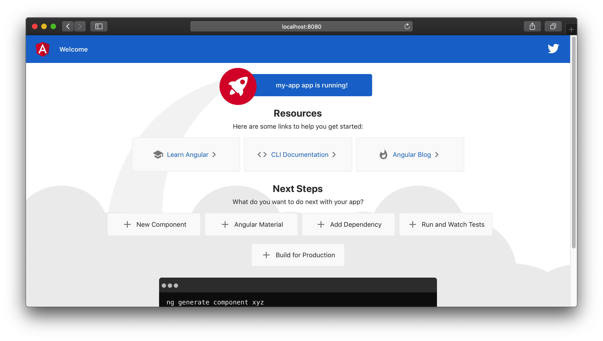
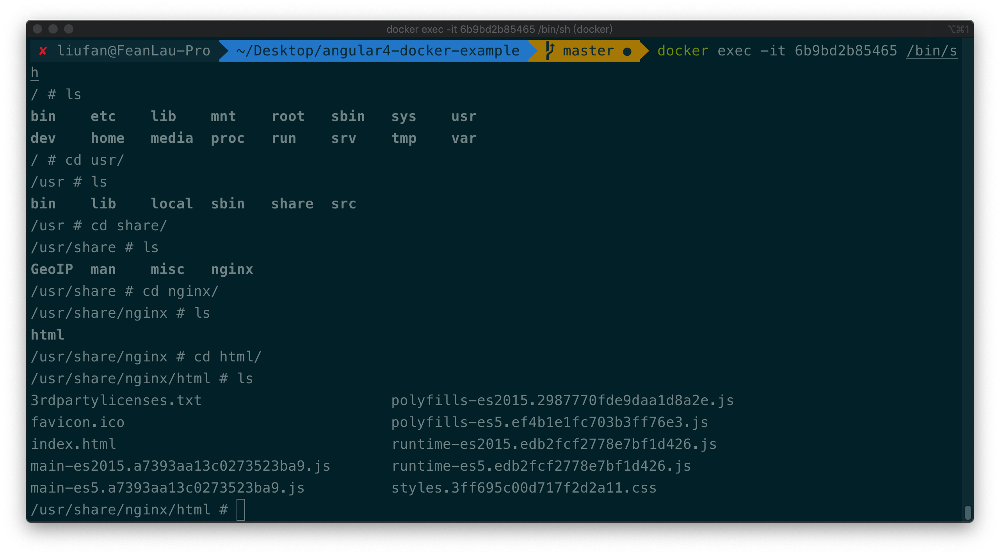

# 用 Docker 容器化部署 Angular6

[](https://opensource.org/licenses/MIT)

## 生成 Docker 镜像

```
docker build -t myapp . 
```

## 运行 Docker 容器

```
docker run -d -p 8080:80 myapp
```

The app will be available at http://localhost:8080

You can easily tweak the nginx config in ```nginx/default.conf```

浏览器打开后截图：




## 进入容器内部

```
# 查看容器id，比如是6b9bd2b85465
docker pa -a
# 查看容器运行日志
docker logs 6b9bd2b85465
# 进入容器内部，查看配置，帮助调试
docker exec -it 6b9bd2b85465 /bin/sh
```

终端运行截图:

